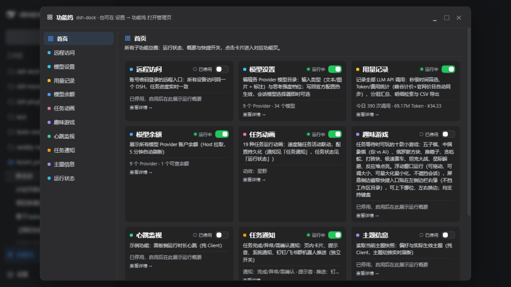
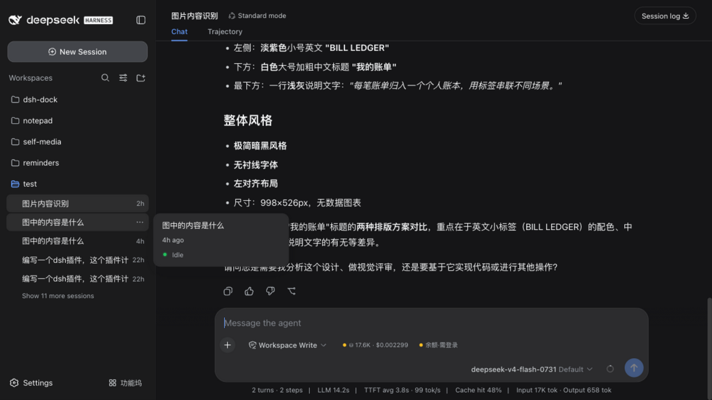
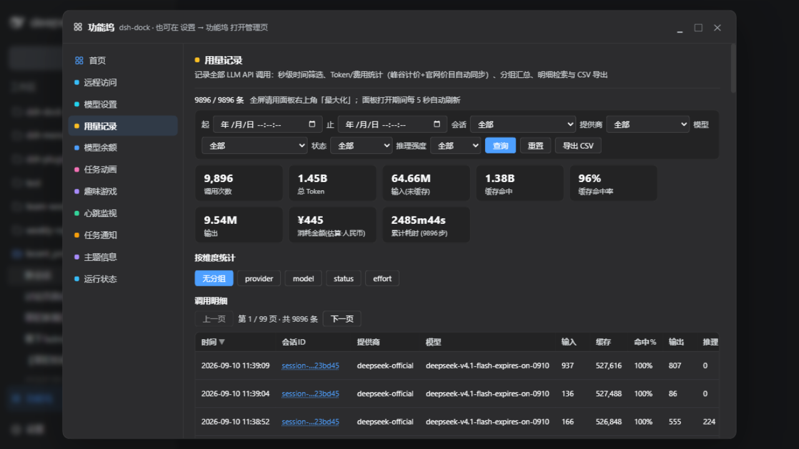

# dsh-dock · 功能坞

[](https://www.npmjs.com/package/dsh-dock)
[](LICENSE)

**DeepSeek Harness 功能坞插件**：用一张管理面板，统一注册、开关所有小功能。

模型余额、用量记录、模型设置、图片理解代理……这些散落的小功能，全部收进一个「功能坞」：
每个功能是独立模块，有注册表、有开关、有错误隔离。新功能按模块追加，老功能互不牵连。



---

## 功能一览

| 功能 | 说明 |
|---|---|
| **用量记录** | 记录全部 LLM API 调用：秒级时间筛选、Token/费用统计（峰谷计价 + 官网价目自动同步）、分组汇总、明细检索与 CSV 导出 |
| **模型设置** | 编辑各 Provider 模型目录：输入类型（文本/图片 + 标注）与思考强度档位；写回官方配置热生效 |
| **模型余额** | 展示所有模型 Provider 账户余额（5 分钟自动刷新） |
| **任务动画** | 任务运行动画（流光细线 / 呼吸光点 / 轨道光环）与完成通知；动画、通知两组开关独立，可推送钉钉群机器人，配置全部持久化 |
| **图片理解代理** | 图片识别等（visionproxy） |
| **心跳监视 / 主题信息** | 示例功能（纯 Client） |

**会话区随身小控件**：启用后，在会话输入区工具行（模型选择器左侧）显示——

- **模型余额**：当前选中 Provider 的账户余额（跟随模型切换实时更新），点击打开功能坞并定位到该 Provider 的余额详情；
- **用量记录**：当前会话的总 Token 与估算花费（10 秒静默刷新），点击打开功能坞并跳转到该会话的用量记录。



勾选「启用」即显示，点芯片跳转；每个功能可在面板页脚或设置页单独设置「会话页显示/隐藏」。

## 界面

点击侧栏底部「功能坞」按钮，弹出功能面板：左侧导航 = 首页总揽 + 各功能模块，右侧内容区。



面板支持最大化 / 最小化 / 还原、标题栏拖动、右下角缩放。

---

## 安装

dsh-dock 是 DeepSeek Harness（dsh）的插件，通过 dsh 插件命令安装：

```bash
# 安装 npm 版
dsh plugin --profile web add dsh-dock

# 或安装本地开发版（克隆仓库后）
dsh plugin --profile web add /path/to/dsh-dock
```

查看 / 卸载：

```bash
dsh web --dump-config                     # 查看合成配置（确认 dsh-dock 已加载）
dsh plugin --profile web remove dsh-dock  # 卸载
```

也可以手动在 `cordis.patch.yml` 中声明插件后重启 dsh。

要求：DeepSeek Harness 环境（dsh），Node.js 18+。

## 使用方法

### 快速上手

1. 启动 dsh：`npx @deepseek-ai/dsh web`
2. 打开浏览器访问 dsh 的 web 界面
3. 在**左侧边栏底部**找到 **「功能坞」** 按钮，点击弹出功能面板
4. 面板左侧是导航：首页总揽 + 各功能模块；右侧是对应内容区

### 启用 / 停用功能

每个功能有独立开关，两个入口：

- **弹窗页脚**：进入某个功能页，页脚显示「已启用（点击停用）/ 已停用（点击启用）」
- **设置页**：侧栏底部 → 设置 → 功能坞，每个模块卡片上有开关

停用某功能后，其菜单项、首页卡片、会话区小控件一并隐藏。

### 会话区随身小控件

启用「模型余额」「用量记录」后，会话输入区工具行（模型选择器左侧）会出现两个小芯片：

- **⛁ 会话用量**：显示当前会话的 Token 数与估算费用（10 秒自动刷新）
- **余额**：显示当前选中模型的 Provider 账户余额（跟随模型切换实时更新）

点击芯片直接跳转功能坞对应页。每个功能可在面板页脚或设置页单独设置「会话页显示 / 隐藏」。

### 各功能使用

**用量记录**
1. 打开功能坞 → 用量记录
2. 使用顶部筛选：时间范围（秒级）、会话、提供商、模型（与提供商联动）、状态、推理强度
3. 查看 9 张 KPI 卡（调用次数 / Token / 输入 / 缓存命中 / 命中率 / 输出 / 金额 USD / 金额 CNY / 累计耗时）
4. 「分组汇总」按 无 / 提供商 / 模型 / 状态 / 强度 维度切换
5. 明细表 15 列可排序，100 行/页，点击「会话 ID」即筛选该会话；行右侧「详情」看单次调用信息
6. 「CSV 导出」下载当前筛选结果

**模型余额**
1. 打开功能坞 → 模型余额
2. 列表展示全部已配置 Provider 的余额/配额状态（每 5 分钟自动刷新，可手动「刷新」）

**任务动画**
1. 打开功能坞 → 任务动画，两组开关完全独立、按需组合：
   - **运行动画**：任务进行中才出现，五种动效任选（默认「流光细线」），**速度随任务吞吐自动加快**（Token 速率驱动）：
     - 流光细线：顶部细线流光往返
     - 呼吸光点：状态徽标圆点呼吸
     - 轨道光环：细环绕圆点旋转
     - 环屏巡航：一颗光点沿屏幕边缘巡航整圈
     - 桌面伙伴：**CSS 3D 立体**的动漫人物（头发/脸/卫衣/坐姿腿，侧身面向镜头）坐在三屏工位前，**流级实时同步任务阶段**——模型思考时仰头冒思考泡泡、正文输出/写代码时低头敲键盘（中屏代码滚动）、查资料时头部左右扫视侧屏；点击卡片可整体拖到屏幕任意位置，位置持久化，防止遮挡内容
   - **完成通知**：任务结束时右上角弹出通知卡片（标题 / 模型 / 耗时 / 回合步骤 / Token / 结果摘要 / 结束原因），可分别开关「完成 / 异常」通知、选择停留时长、开启浏览器系统通知（仅页面后台时推送）
2. 任务结束动效自动消失，完成瞬间一缕流光掠过；功能坞面板打开时环境动效自动隐藏避免重叠
3. **钉钉推送**（可选）：任务结束由宿主直发 markdown 消息到钉钉群机器人（浏览器关着也能推）——填入 Webhook 地址保存，「发送测试消息」验证连通；机器人安全设置选「自定义关键词」填「任务」或「dsh」；推送哪些事件跟随上方「完成 / 异常通知」开关
4. 所有配置（动画开关 / 动画模式 / 通知各项 / 钉钉 Webhook）经宿主 settings 持久化，重启 dsh 后自动恢复

**模型设置**
1. 打开功能坞 → 模型设置
2. 编辑各 Provider 的模型目录：输入类型（文本 / 图片）、思考强度档位
3. 保存后写回官方配置，即时生效（无需重启）

**图片理解代理（visionproxy）**
- 用于图片内容识别等场景，模型设置中勾选「图片」输入类型的模型即可走该通道

**心跳监视 / 主题信息**
- 示例功能，展示纯 Client 功能模块的写法

### 常见问题

- **插件会消耗 token 吗**：默认不会。用量记录/模型余额/任务动画/模型设置都是被动监听或本地查询，不调用 AI。唯一主动调 AI 的是「图片理解代理」（用视觉模型识图），它**默认关闭**，需你在模型设置里手动开启才生效；开启后每次识图按所选视觉模型计费。
- **功能开关刷新后重置**：v0.5.0 起功能开关已持久化（浏览器本地存储），刷新/重启后保持。
- **任务动画/通知不生效**：动画路由与配置持久化在宿主进程内，旧宿主需重启 `dsh web` 加载（面板页会提示「宿主进程是旧版本」）。
- **用量记录空白**：确认 dsh 是较新版本且插件宿主已加载（查看启动日志含 `[dsh-dock] host half loaded`）；旧宿主进程需重启 dsh web 加载新路由。
- **余额显示「需登录 / 无密钥」**：对应 Provider 未在 dsh 凭据中配置可查询余额的密钥，属正常状态提示。

## 开发：新增一个功能模块

每个功能是一个 `features/<id>/` 目录，由两部分组成：

```
features/<id>/
  host.js        # 宿主半部：注册 RPC 路由 / 定时任务（纯 ESM，零构建）
  view.js(x)     # 客户端视图：渲染面板内容（自带样式，CSS 类名带前缀隔离）
```

在视图模块导出功能描述符：

```js
export const feature = {
  id: "my-feature",
  name: "我的功能",
  order: 160,              // 菜单排序（首页固定第一，数值越大越靠后）
  accent: "#22c55e",       // 品牌色
  description: "…",
  css: "…",
  View: MyView,            // 面板内容组件，收到 { ctx, feature, params }
  HomeStat: MyStat,        // 可选：首页总揽卡片统计
  Chip: MyChip,            // 可选：会话输入区小控件
  Overlay: MyOverlay,      // 可选：功能全局浮层（功能启用即常驻整页挂载，如任务动效/通知）
};
```

外壳只做组装：宿主半部在 `index.js` 注册，客户端在外壳 `src/client.jsx` 装配。
每个模块可整体拎出单独打包发布（`scripts/extract-feature.mjs` 生成独立包骨架，
独立包装回后经 **dockBridge** 注册回功能坞菜单）。

## 许可

[MIT](LICENSE)